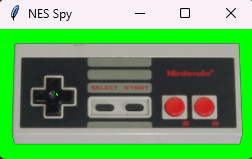

# NES Wireless Controller

**Turn your original 1980s NES pad wireless – without cutting it open.**

When my internet went down one evening and Steam was useless, I dug out my
old NES.  While looking for the cartridge, I also found two ESP32 boards and
a crazy thought hit me: what if the controller itself could go wireless *and*
stay completely stock?  A quick trip to the interwebs later I had an
extension cord in the mail, I cut it in half, wired each half to an ESP, and
just like that the project was born.

The ESPs live in a little dongle between the controller and the console, so
your vintage pad remains untouched.  I’m sharing the code and design here
because it was fun to build and I think other retro gamers will enjoy it too.

---

## What you need

* 2× ESP32 development boards (any flavour will do)  
* A NES extension cable (the long one between pad and console)  
* Female jumper wires, heat‑shrink and optional hot glue.  (If you
  really want to go all‑in you can solder the leads directly to the ESP32 or
  even design a little PCB with the connector built in – for example you can grab the connector from Europe with faster shipping at [Zedlabz](https://www.zedlabz.com/products/controller-connector-port-for-nintendo-nes-console-7-pin-90-degree-replacement-2-pack-black-zedlabz?srsltid=AfmBOorLNYLtyGLcgUVKGPlg8VS46CnAKE-XDuBqMxV1WkUjW-lOKhSV) )
* A multimeter for tracing the four signal lines  
* An original NES controller and a working NES console  

---

## Wiring & setup

Cut the extension cable in half.  On the controller end identify the
following wires with your meter:

* **VCC** (+5 V from the console)
* **GND**
* **CLOCK**
* **LATCH**
* **DATA**

The controller is tolerant of 3.3 V, so feed the +5 V line into the ESP32’s
`3V3` or `5V` input pin.  Tie the other four signals to any free GPIOs – the
example code uses pins 21, 22 and 23, but you can remap them by editing the
`#define` values in the `.cpp` files.

Then create two separate PlatformIO/Arduino projects: one for the
**controller side** (the sketch is provided as `sender_controller.cpp`), and
one for the **console side** (`receiver_nes.cpp`).  Copy each file into its
own project directory and save it there as `main.cpp` before building.
Flash the appropriate sketch to each ESP32 and power them up.

**Important (Receiver / Console Side)**:
> The console provides 5 V.  Even if some ESP32 boards accept 5 V on the VIN
> pin, designs vary and back‑powering can **damage the regulator or chip**.
> To be safe, don’t connect the NES VCC line to the ESP32 at all;
> treat the cable as signal‑only.

> Only hook up GND, CLOCK, LATCH and DATA on the receiver dongle.
> Power the ESP32 from USB, a battery, or a regulated 3.3 V supply instead.

> Also remember: standard ESP32 GPIO are **not** 5 V tolerant.  If you're in
doubt about signal levels, use a proper level shifter (don’t trust AliExpress
> or Temu; choose a reputable brand) or a series resistor to protect the pins.
> A good example datasheet is available here: [KY-051 level‑translator PDF](https://asset.conrad.com/media10/add/160267/c1/-/de/001695385DS01/datablad-1695385-voltage-translator-level-shifter.pdf).

---

## Visualiser (bonus)

When I stream on Twitch I like to show my button presses.  That’s what
`visualiser.py` does – it reads the serial output from the receiver ESP and
renders a little NES skin with blobs for the pressed buttons.  The script
validates the serial port and baud rate you enter and lets you cancel
before the main window opens.  Make sure the receiver is configured to use
the same baud rate (for example 9600 or 115200); if it doesn’t, the
visualiser simply won’t receive the expected bytes and the pad will remain
blank rather than updating.
Once a real port is selected the GUI runs on
Windows, Linux, macOS, etc.  It’s basically a cross‑platform remake of
NintendoSpy.

* Included are a `visualiser.bat` and `.sh` file for cross‑platform launch
  on Linux/Mac make sure to `chmod +x` the `.sh` file
* The launcher scripts will check for Python 3 and the required modules,
  and notify you if something is missing

---

Have fun soldering – and if you print a little NES‑style case for the dongle,
set of stylus, or RGB LEDs, I’d love to see pictures!  This project is meant
to be a playful hack, not a serious commercial product, so feel free to
modify and share.

## Fun facts

* The original prototype used AP mode and UDP between the two boards.  It
  worked… except for a bizarre bug where pressing **Right** on the D‑pad
  sometimes produced a phantom **A** press.  After a few hours of chasing
  ghosts I rewrote the link over BLE and the problem vanished.
* I built the adapter as a cable‑cut dongle deliberately so the controller
  itself stays untouched – just plug it in like a normal extension and the
  wireless circuitry is entirely external.
* I already have an SNES about to receive a similar treatment – I’d like to
build a dongle for it too.  Off‑the‑shelf wireless pads and cheap China
clones exist, as well as bespoke ‘8bitdo’ controllers, but none of them
feel quite right in hand like the original.  Adding the built‑in visualiser
could be a neat touch for streamers too.
* **Bonus bonus!**  You could modify the Receiver sketch to read from an
SD‑card module and feed it a TAS (tool‑assisted‑speedrun) file – suddenly
your setup doubles as a TAS console verifier.

## License

* This project is released in the spirit of the Unlicense.
  Do whatever you want with it — fork it, modify it, build on it, improve it, just dont make kittens cry, or build a Space Rocket with it.

* All I ask is simple:

  If you use or modify it, keep a reference to the original repo.

  Don’t re-upload or fork it unchanged and claim it as your own work.

  Let’s keep things fair and keep the NES alive.

  This project is provided as-is, without warranty of any kind.
  I’m not responsible for any damage to your controller, console, or other hardware — especially if you didn’t read the sketches or feed 5V where it doesn’t belong.

 Have fun. Build cool stuff. Share it.

## Personal Notes

* Last note: Pull Requests are always welcome, however, i would like a demo in form of a screen recording or video of the new feature to see it working,
  as your hardware might be slightly different than mine, and i might not be able to reproduce the feature.
  Important for the video: Only Display the feature in action and maybe the required Hardware mod, **NOT YOURSELF** or anything personal.
  The Internet is unsafe as is already, lets keep it safe for us Retro Nerds! :) 